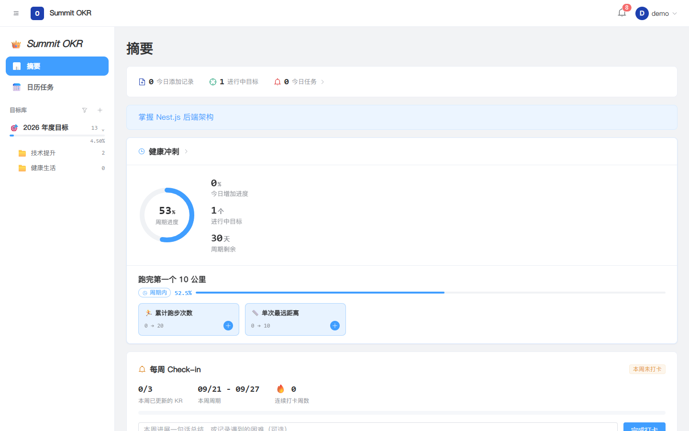
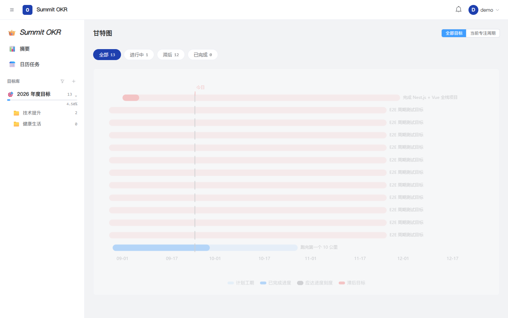

# Summit OKR - 面试作品集项目

基于 OKR 理念的个人目标管理系统，多端技术栈实现。

## 界面预览

以下为本仓库 Vue Web 端使用演示账号运行时的画面。

| 摘要 | 甘特图 |
| --- | --- |
|  |  |

## 技术栈

- **后端**: Nest.js + TypeScript + Prisma + PostgreSQL + Redis
- **前端 (Web)**: Vue 3 + Vite + Pinia + Element Plus
- **Monorepo**: pnpm workspace

## 快速开始

### 1. 启动数据库

```bash
docker compose up -d
```

### 2. 安装依赖

```bash
pnpm install
```

### 3. 配置环境变量

```bash
cp apps/backend/.env.example apps/backend/.env
```

### 4. 初始化数据库

```bash
pnpm db:generate
pnpm db:migrate
pnpm db:seed
```

### 5. 启动开发服务

```bash
pnpm dev
```

- 后端: http://localhost:3000
- 前端: http://localhost:5173
- Swagger: http://localhost:3000/api/docs

## 项目结构

```
summit-okr/
├── apps/
│   ├── backend/           # Nest.js 后端
│   └── web-vue/           # Vue 3 Web 端
├── packages/
│   ├── api-types/         # 共享 TS 类型
│   ├── api-client/        # HTTP API 客户端
│   └── utils/             # 工具函数（算法）
└── docker-compose.yml
```

## 文档

- [开发需求文档](../SUMMIT_OKR_开发需求文档.md)
- [分批开发计划](../SUMMIT_OKR_分批开发计划.md)
- [多端技术栈规划](../SUMMIT_OKR_多端技术栈规划.md)
